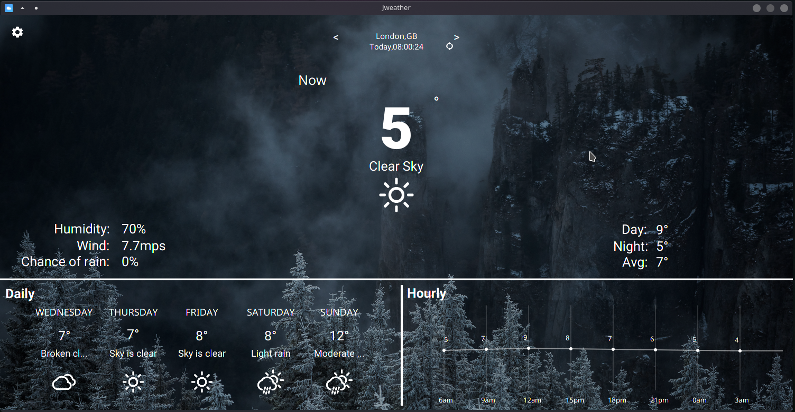

# Jweather

Hi , Jweather is a simple weather application . It's not something to use very commonly . It just shows the weather basicly ... 

# Installation 

first of all install javafx from [here](https://openjfx.io/), then you need to create a environment variable . Remember varibale should named ``JAVA_FX`` unless application can't be lunched . 

``
export JAVA_FX=path/to/javafx-sdk/lib
``
put this line in your .zshrc or .bashrc (replace with your own javafx path !!!!)

then download latest verison of Jweather form [here](https://github.com/HarlyquinForest/Jweather/releases)

now move to Jweather-installtion and 
``chmod +x install &&
./install
``

Please report if you found any bug , of if installation doesn't work . 

Thank you 

